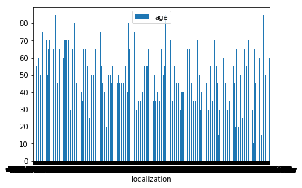
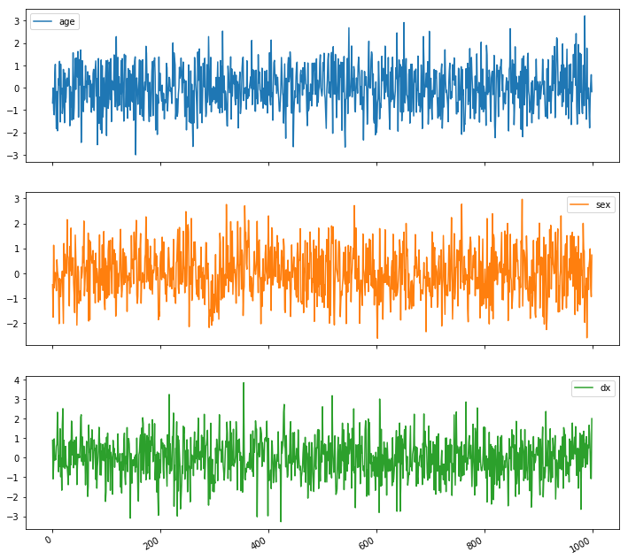
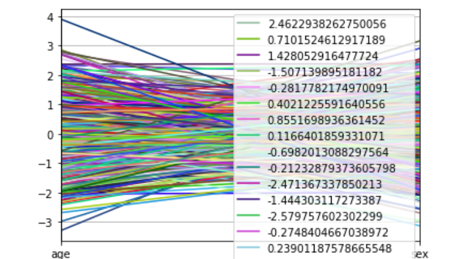
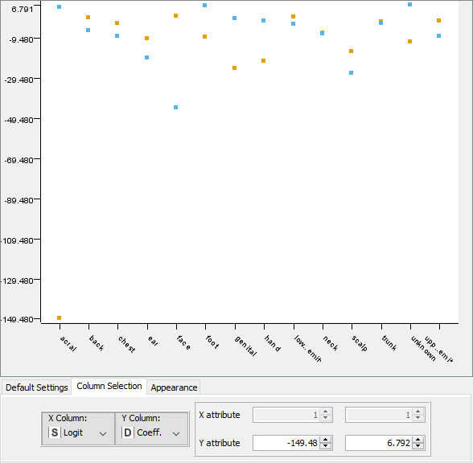

Morphological Image-based Profiling of Cells for Scientific Community :hand: fa18-523-52

| Anna Heine
| avheine@iu.edu
| Indiana University
| hid: fa18-523-52
| github: [:cloud:](https://github.com/cloudmesh-community/fa18-523-52/blob/master/project-report/report.md)
| code: [:cloud:](https://github.com/cloudmesh-community/fa18-523-52/tree/master/project-code)

---

Keywords:
fa18-532-52, lesion, medical

---

## Abstract

One major area that is being utilized highly today within big data platforms is
that of medical image collection. Medical image datasets are often used as 
training tools as a source of comparison when analyzing diagnostic images from
current or past cases of diseases. The issue in this field is that current 
datasets lack the diversity and number of samples that is necessary to make
sufficient predictions based on analysis. With valuable datasets, medical 
advances can be made to deliver more personalized medicine, to create predictive
diagnostic models, research treatment methods, improve the overall value of 
healthcare, and much more. The main goal of medical big data analysis is to find
associations and correlations within complex data. The HAM10000 dataset is a 
significant resource for analysis because it includes over 10,000 dermatoscopic 
images that have been carefully stained and optimized to display skin-lesion 
biopsies. The grafts entered into this dataset were verified and therefore proven
worthy based on expert consensus, a follow-up, and in-vivo microscopy. Each 
individual donation is tracked by its patient identification number, image 
identification number, donor age, donor sex, localization on the body, and a 
final inclusion reasoning. 

## Introduction

The big data revolution has changed multiple industries around the world, one of
which largely includes the field of medicine. The role of big data in the medical 
sector is high-grade as it aims to be predictive in order to diagnose patients and
even discover new treatment methods. This means that the data obtained and used in 
these models must be wide enough to include a variety of patients and diseases. 
Disease is a major unknown for many reasons in medicine. Big data has recently been
shown to be beneficial in disease management as it provides aggregate information 
around multiple aspects of a disease. For example, some datasets include functionality
and characteristics of DNA and RNA, proteins, cell types, tissues, organs, and more
[@fa18-523-52-intro]. The ability for these models to evolve and grow are what will 
advance the predictive analysis so desired in the field today. The sources of big data 
are varied. Some of which include administrative claim records, electronic health
records, the internet, medical imaging, and clinical trials [@fa18-523-52-ncbi]. 

Despite the vast number of sources, medical big datasets can be quite different than 
other types of big data. The main difference is located in the form of accessing the 
data. Because of privacy laws and ethical stances, some medical data is hard to come by.
The fact that data has been breached in other industries such as in business and 
consumerism models, most people are hesitant to include large amounts of people's private
health records in one location. That being said, medical datasets have to be managed so 
that the records being added follow a specific, structured protocol. These datasets are 
also costly, as they may need to be examined and measured multiple times by trained 
personnel to ensure correctness. The nature of the data is therefore, dangerously 
susceptible to human error, as most of it usually contains information we are not very 
sure about to begin with. Although data scientists have found methods and reasonings that
allow for the production of medical datasets, they are often unreliable because the amount
of data contained is just too small to make any valuable inferences or claims. 

Though there are many challenges medical big data will need to dissolve in order to gain
popularity and trust, the field is already proven to hold valuable insights. For example,
the field will expand the use of big data into other industries by providing a basis for 
accumulating data of various sources and materials. Medical big data can provide answers
to uncertainties even when lacking substantial evidence. The influx of continued large 
medical datasets is contributing to the advance of trusted future predictive healthcare
learning models. The overall goal is not to automate the position of a trained physician,
but to make the diagnostic process much easier and more efficient as well as aid in 
several areas of medical research. 

The realm of skin cancer research is more or less crying out for big data analysis.
Melanoma, specifically, affects around 73,000 new people each year which will result in
about 9,000 deaths [@fa18-523-52-digital]. There is no general biomarker for melanoma, which 
causes for imprecise diagnostic margins. With this prelavence of disease in society, the 
amount diagnoses per melanoma skin lesion sometimes reaches up to 36 because of 
false-negative uncertainties [@fa18-523-52-digital]. However, with big datasets and the use
of computer algorithms, there has been a significant increase in diagnostic accuracy -less 
than 5% error rates. 

## Requirements

This project requires Python 2.7 or greater to integrate the Pandas and NumPy packages. It 
also requires at least 420 KB of storage to hold the HAM10000 dataset. The project also 
requires Anaconda to access Jupyter Notebook with Numpy and Pandas packages installed. 

## Design 

The design of the project was to obtain the dataset and test it on a number of web services.
First, I tested it on Jupyter Notebook to get a baseline of the components within the dataset.
After creating some visualizations, I then incorporated the data into a cloud service.

## Architecture

Before I made any implementations on this project, I realized that I would be using
multiple software packages. Therefore, I wanted to ensure that they were all in the
same place. To do this, I installed Anaconda. Anaconda is an open-source, free
distribution software with Python and R available packages already installed. It's 
main purpose is to provide simple tracking of these packages with an easy, user-friendly
dashboard design[@fa18-523-52-conda]. Each version of its packages are managed by its
package management system, Conda. In Anaconda, I used Jupyter and Jupyter Notebook to 
perform most of my data analysis. Jupyter allows for data manipulation across many 
programming languages. Jupyter is also an open-source web application that allows for 
distribution of documents, code, and other projects for collaboration. It has many uses:
data cleansing, statistical data modeling, visualization, machine and deep learning, data
transformation, and more. Once a project has been created, your work can be output as HTML,
images, video, or LaTeX[@fa18-523-52-jupyter]. The Notebook specifically can contain both 
code and text. These formats have the ability to create descriptions and visible output for
graphs of many types. Jupyter runs via client-server, which means it does not need Internet
access to be run. Each notebook contains a kernel which controls the execution of the code
inside it. For example, if you wanted to execute Python code, the notebook would execute
via the ipython kernel. To manually execute a file, the user must either choose to run 
each cell one at a time by clicking Run on the left of each line or by cliking on Run All
in the Cell menu[@fa18-523-52-jupyterNotebook].

NumPy is a package that interacts with Python to provide numerical operations. NumPy uses
its own defined library to make things like arrays and matrices and invoke operations on 
them. The most basic object in NumPy is the ndarray object. The ndarray holds arrays of 
homogeneous data types which are compiled for efficiency. NumPy arrays have a fixed size
array and are homogeneous, which is different from regular Python arrays. NumPy also has
vectorized and broadcasting behavior which both work to amplify performance and decrease
compile time. Vectorized code is simple and easy to read code that typically is prone to 
less bugs. The code sometimes is mistaken for mathematical notations, but of course, 
results in Python-looking code. Broadcasting describes the step-by-step behavior of 
operations. It is beneficial in taking the outer operation of two arrays to make a combined
array. However, both arrays must be of same dimension[@fa18-523-52-numPy].

Pandas is a Python package also automatically downloaded with Anaconda. It provides many
data analysis features that are widely used in data visualization. Pandas is able to 
incorporate many types of data formats as well. For example, Pandas can read in tabular 
data from SQL or Excel, it can obtain ordered or unordered data, arbitrarily matrixed data,
and it can even read in data that has no labels. Pandas is able to handle missing values and
also non-floating point data by labeling it as NaN. One important feature I specifically
used was to convert data that incorporated NumPy structures into DataFrame objects. This 
feature allowed Pandas to easily read and control the data into an acceptable format that
was able to successfully create a readable graph. Another convienient tool I used while 
manipulating my dataset was Pandas ability to slice and create subsets of my data. This 
allowed me to create new tables and graphs from carefully selected data where I saw possible
correlations. To create detailed visualizations, Pandas incorporates matplotlib API 
[@fa18-523-52-pandas]. Matplotlib allows the import of visualization libraries that can be
read by Pandas. Matplotlib is a 2D plotting library that can be used in Python scripts and
the Jupyter notebook, which I have previously mentioned. Some examples of the types of plots
matplotlib includes is histograms, bar charts, scatterplots, errorcharts, power spectra, and
more[@fa18-523-52-matplotlib]. 


## Installation
To install Jupyter itself you must already have Python 2.7 or Python 3.3 or greater. It
is recommended to go ahead and download Anaconda, like I did, so that all of your packages 
are in one place. To download the latest version of Anaconda, follow the code below:

```python
import webbrowser
webbrowser.open('https://www.anaconda.com/download/')
```

From there, you will have to choose which operating system to download from. That is all 
you have to do to install Anaconda. You know have an open platform with many packages 
for use. One of these packages is Jupyter Notebook. To run Jupyter Notebook the following
line into the command prompt:

```bash
jupyter notebook
```

Now you can begin using Jupyter's Notebook to create visuals and write code for that
manipulates your data. NumPy and Pandas are also automatically downloaded with the latest
version on Anaconda. 

## Dataset

The dataset I have chosen is often used in training tools for medical
professionals and is one of the only few available skin lesion datasets. The HAM10000 
(Human Against Machine with 10000 training images) dataset contains dermatoscopic images
from different populations that include all general diagnostic categories that have been 
discovered in this type of medicine. The diagnostic categories in this dataset include
diseases such as: Bowen's disease (akiec), basal cell carcinoma (bcc), benign keratosis-
like lesions (bkl), dermatofibroma (df), melanoma (mel), melanocytic nevi (nv), and 
vascular regions (vasc). The confirmation of the samples that were entered into the 
dataset are given: histopathology (histo), follow-up examination (follow_up), expert 
consensus (consensus), or confirmation via in-vivo confocal microscopy (confocal). Each
image within the dataset can be tracked by their lesion-id [@fa18-523-52-harvard].

## Implementation

The first part in analyzing the HAM10000 dataset is to acquire it as well as the Anaconda
platform. Once you access the Jupyter Notebook and import the necessary Python packages,
you are ready to begin analyzing the data. Jupyter is a great tool to use in data analysis
becuase you can easily manipulate your code line-by-line. By performing multiple plotting
algorithms, you get a great visualization of relationships amongst the dataset. Of course,
there are simple methods to analyze singular features and columns in your dataset. The 
method below shows multiple statistical analyses on the age feature.

```python
db['age'].describe()

count    9919.000000
mean       52.067749
std        16.686741
min         5.000000
25%        40.000000
50%        50.000000
75%        65.000000
max        85.000000
```

The first algorithm that was used in my Jupyter-based script was a DataFrame comparison 
between the localization and age features. This comparison shows the number of patients who
recorded diagnosed skin lesions for different locations in addition to their differing
ages. The Pandas DataFrame is a class that has the ability to take in a mutable, 
two-dimensional data structure that contains labeled axes[@fa18-523-52-pandas]. It is known
as the primary Pandas data structure. There are many examples of methods that can be used
with this structure on Pandas documentation. To configure a visual of this correlation, the
following code was imposed:

```python
#name the database file to your liking after completed download
db=pd.read_csv('534data.csv')
df3 = pd.DataFrame(np.random.randn(1000, 2), columns=['age', 'localization']).cumsum()
df3['localization'] = pd.Series(list(range(len(db))))
df3.plot(x='localization', y='age')
```

The generated plot is as shown below +@fig:localAge :

{#fig:localAge}

The visualization makes it obvious that there can be many different localizations per age
group. This visualization also supports the need for varied datasets in the clinical domain. 
It ultimately makes it quite difficult to make assumptions on singular lesion samples because
the locations are varied no matter the age. 

Another algorithm that was imposed on Jupyter Notebook to create a visual analysis was an 
autocorrelation analysis. Autocorrelations are important in data analysis because they give
important information regarding the quality of your dataset. Specifically, it checks randomness
within your values with can also give clues to missing or empty values that you may have 
missed when cleaning the data. Over time, the data is compared to see if it lies near zero. If
the data is considered random, the time series autocorrelation will be near zero for all time-
lag separations. If the series is considered non-random, then the autocorrelations will be 
non-zero. The graph that is generated shows two horizontal lines that indicate 95% and 99% 
confidence bands. Using the following code, I have generated the following autocorrelation plot
+@fig:autocorrelation. 

{#fig:autocorrelation}

Since the values in the above autocorrelation plot are within the 95%, and some very close to the
99% correlation lines, it can be said that the dataset is far from random. This is promising
because it reinforces the quality and trust within the dataset. 

Another technical tool that I used to analyze my dataset was the KNIME Cloud Analytics Platform
[@fa18-523-52-KNIMEcloud]. The KNIME cloud can be integrated via the Azure Marketplace or on 
Amazon AWS. 

:o: discuss KNIME tech and cloud integration

Creating visualizations in the KNIME platform is extremely easy. The steps to create visual 
analyses on KNIME's analytic platform are to first drag and drop the CSV Reader node into the 
workflow. Once in the workflow, import the dataset from where you saved it locally by right-
clicking on the CSV Reader node, and choosing Configure. Once the dialog box pops up, choose
the number of rows and columns to include (I included them all). Then, choose which algorithm 
you would like to impose on the dataset by searching the node directory again. For my first 
analysis, I chose to do a basic graph showing the amount of different diagnostic descriptions
per area (localization). The figure below shows this correlation, +@fig:dx. 

{#fig:dx}

The above image shows proof that although some diseases are more relevant than others, it is
important to have variable datasets such as these. Having so improves the accuracy of other
diagnoses because of the increased comparison amongst individual units of data. It emphasizes
that no matter the location, there can be many different types of apparent disease types. 
Another created image is the visual of density among three data features. I chose to generate
this graph with all three features along separate axes. The figure below indicates these 
results +@fig:subplots52.

{#fig:subplots52}

Using KNIME's analytical platform, I was able to use defined algorithms to further expand my
visualizations. One algorithm I explored was that of parallel coordinates. Parallel coordinates
is a graph that exemplifies the many differences between multiple variables and features. In the
graph I've generated, the age and sex features are placed on their own axes. The lines that 
connect the two features together are the actual values of the two features. Each line can be 
seen as an accumulation of the points that lie upon each axis [@fa18-523-52-pc]. The downside of
this algorithm is that sometimes the dataset can make the graph look somewhat dense. The figure 
below shows the parallel coordinates of age and sex within the HAM10000 dataset, which is also 
quite dense +@fig:pc.

{#fig:pc}

KNIME allowed me to create this visualization without the use of any code, as their GUI is 
simple enough that programming is not always necessary. However, I also created this picture 
through code in Jupyter Notebook. The following script shows how I was able to do this.

```python
from pandas.plotting import parallel_coordinates
df=pd.DataFrame(np.random.randn(1000, 2), columns=['age', 'sex'])
parallel_coordinates(df, 'dx')
```

Another algorithm I incorporated was logistic regression. This type of analysis compares a
nominal independent and dependent variable. The regression model is used to predict a 
possible outcome between the two given variables[@fa18-523-52-lg]. The logical question I thought
of when performing this analysis was if the location of skin cancer on a person's body had any 
influence or correlation on which type of cancer it was. 

:o: include lit review on this topic

The following image +@fig:lg52 was created to show the logistic regression in this dataset. It 
shows that the relationship between cause of diagnosis (description/dx) and location is very 
much varied. There are, of course, some outliers, but it seems as though one can conclude
that many different types of skin cancers can occur in numerous locations. This can be 
useful for medical professionals or students who are using this dataset as a training 
tool. It can also be said that conclusions can not automatically be made on what type of
cancer is in a given region just by initial glance or statistics. 

{#fig:lg52}

A good algorithm to test the relationship between diseases and the sexes is a regression tree. A
regression tree is an algorithm that predicts the results of two, usually categorical, variables.
The regression model is quite easy to interpret. Using KNIME's analytical platform, I conducted 
a predictive regression tree diagram of the sexes within the HAM10000 dataset. The results show 
that the dataset includes a higher number of diseased males than females. The figure below shows 
the results in the model of the actual regression tree +@fig:tree52. This analysis is also 
important to know because there is no evidence that strongly supports a specific sex to have a
greater or lesser chance of developing a disease. It is easy to see that there are 54.7% of males
with diseases in the dataset and 48.8% of females with diseases. 

{#fig:tree52}


## Benchmark

## Conclusion

## Acknowledgement
